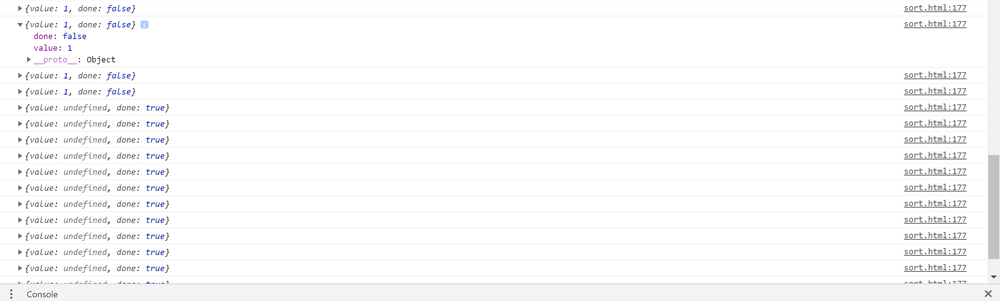

# jsSortAnimation

利用 flex 布局先布局好

---11.19 早改

利用 if（divs[j])这样的条件判断 divs[j]是否存在 来决定是否改变颜色，这样就不会控制台一堆报错了

之前控制台一堆报错，但程序能稳定运行，很迷=-=

---

11.19 晚上改-

学长建议使用生成器 ， 大概的理解生成器的含义

这次 sort.html 则利用了生成器

代码精简了一万倍 简直不要太好用

可能对生成器的定义目前还是一知半解 就知道可以用来暂停？随时继续

这次写了三个函数 每个不同的按钮调用不同的函数 数组生成和交换函数都还是没变

总体来说效果还是有的 代码也精简了 就是不知道是不学长想要的那种方法 但总归比之前的代码莫名其妙的好

## 把 ES6 生成器的定义记一下把

利用`function* 函数名（）{}`来定义生成器

```js
function* SheepGenerator(){
    let index = 1;
    while(true){
        yield index++;
    }
}

let countSheep = SheepGenerator();

countSheep.next().value; // 1
countSheep.next().value; // 2
countSheep.next().value; // 3
countSheep.next().value; // 4
。。。
```

你能数到天荒地老。。。只要调用，就有产出。这就是一个最基本的生成器函数。

形式上，Generator 函数是一个普通函数，但是有两个特征：

#### function 关键字与函数名之间有一个星号\*；

#### 函数体内部使用 yield 表达式，定义不同的内部状态。

Generator 函数的调用方法与普通函数一样，也是在函数名后面加上一对圆括号。不同的是，调用 Generator 函数后，该函数并不执行，返回的也不是函数运行结果，而是一个指向内部状态的指针对象，即遍历器对象（Iterator Object）。必须调用遍历器对象的 next 方法，使得指针移向下一个状态。那么什么是状态呢？

`countSheep.next() // {value: 6, done: false}`

通过 next 方法调用生成器函数，发现返回一个对象，其中 value 表示当前产出的值，done 表示是否还有下一个值，如果没有（done: true）(但是当不存在 return 语句时，就算没有下一个 yield，最后一个 yield 也会为 done:false)，继续调用返{value: undefined, done: true}，value 值变为 undefined，就算下次没有值了，你也可以继续调用，只不过返回的 value 是 undefined

## yield 妙用：

yield 将生成器分为一个一个节点，每次调用.next 方法时，指针就会移到 yield 节点处，产出当前值，再次调用.next 时，指针就会移到下一个 yield 节点处，以此类推。。。如果遇到 return 语句，标志 return 是最后一个 yield 节点，return 后面的 yield 会被忽略：

目前我能想到的就这些，或者说用得到的就这些把=-=

[引用的资料 1---简书](https://www.jianshu.com/p/154804e7b3cf)

[引用的资料 2---廖雪峰](https://www.liaoxuefeng.com/wiki/1022910821149312/1023024381818112)

---

一个小 bug



排序完了定时器没清楚，会一直继续 返回 undefined 再点击事件里加个判断条件就好

因为不需要扫描返回值 所以应该可以用 yield 返回 1 表示正在运行 当 return 0 ；表示排序完成 或者可以判断返回对象的 done ；

```if (Sort.next().done) {
​         clearInterval(timer);
}
```

当调用 shor.next().done 时候，还是会继续执行函数，返回的是 done 其实应该就是 obj.done 这样的用法=-= 无法用语言表达 就是这样的~

---

我这里利用输入框输入数据 然后读取 input 的 value 值获取输入的数据 利用 split 分割读取到的字符串存入 arr 数组-有默认数组

通过按钮选择三个不同的排序方法：

选择排序：从第二个开始，与第一个相比，选择最小的 选中变成紫色，然后与第一个交换--这里交换没用到动画 就一个 swap 函数将高度和数字交换了，然后 i++ 继续循环寻找第二小的和第二个交换

因为要做到动画，无法用到 for 循环 用了`setInterval`定时器，或许可以用到 for 但是目前想不太通

最后是将动画完成了

冒泡排序：每两个比较，若前面的大于后面的则交换，每一层冒泡都能将最大，第二大的冒泡到最后，一样用到了`setInterval`定时器

插入排序：从第一个开始，选择一个数插入到前面已排序好的数组中，若选中的数比比较的排序好的数组中某个数大，则已经排序好 ，否则插入到这个数前面 并继续和更前面的一个数比较


```

```
