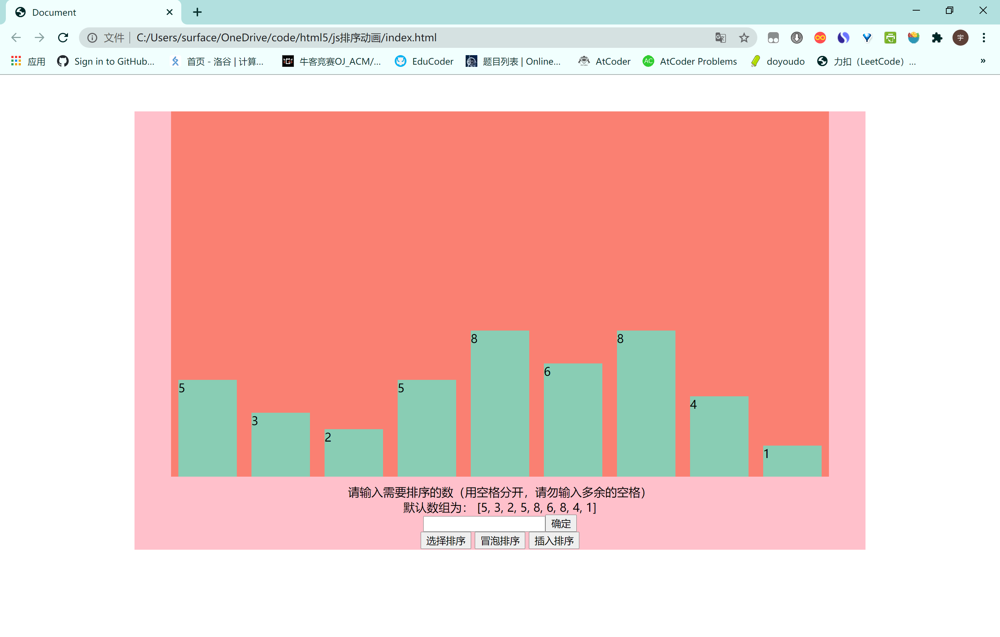
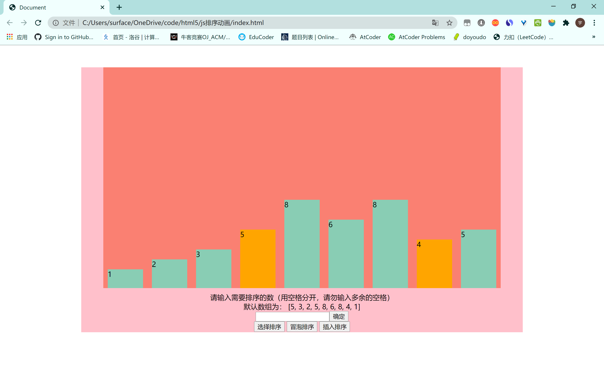
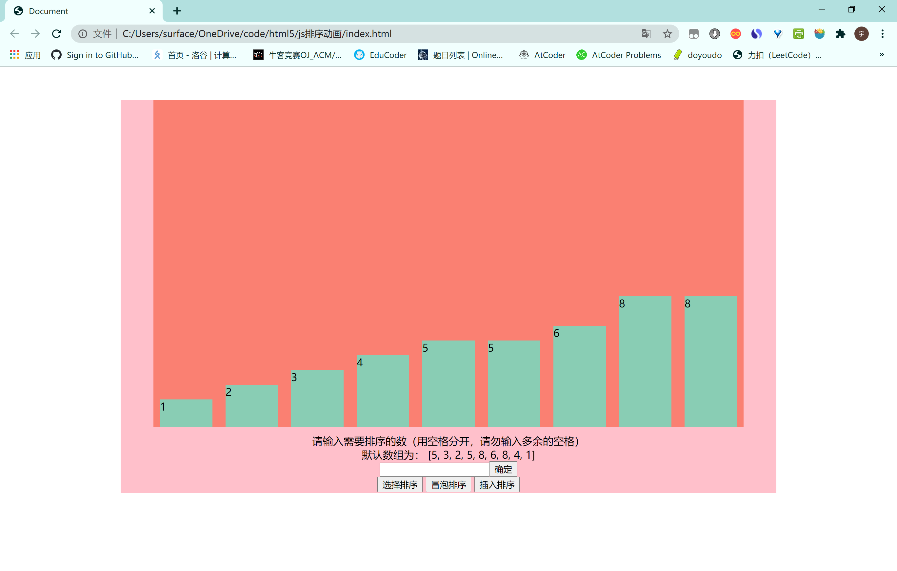

# jsSortAnimation

利用 flex 布局先布局好

---11.19 早改

利用 if（divs[j])这样的条件判断 divs[j]是否存在 来决定是否改变颜色，这样就不会控制台一堆报错了

之前控制台一堆报错，但程序能稳定运行，很迷=-=

---

我这里利用输入框输入数据 然后读取 input 的 value 值获取输入的数据 利用 split 分割读取到的字符串存入 arr 数组-有默认数组

通过按钮选择三个不同的排序方法：

选择排序：从第二个开始，与第一个相比，选择最小的 选中变成紫色，然后与第一个交换--这里交换没用到动画 就一个 swap 函数将高度和数字交换了，然后 i++ 继续循环寻找第二小的和第二个交换

因为要做到动画，无法用到 for 循环 用了`setInterval`定时器，或许可以用到 for 但是目前想不太通

最后是将动画完成了

冒泡排序：每两个比较，若前面的大于后面的则交换，每一层冒泡都能将最大，第二大的冒泡到最后，一样用到了`setInterval`定时器

插入排序：从第一个开始，选择一个数插入到前面已排序好的数组中，若选中的数比比较的排序好的数组中某个数大，则已经排序好 ，否则插入到这个数前面 并继续和更前面的一个数比较

